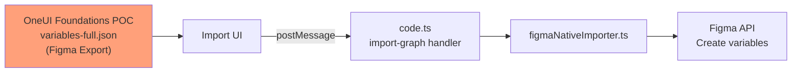
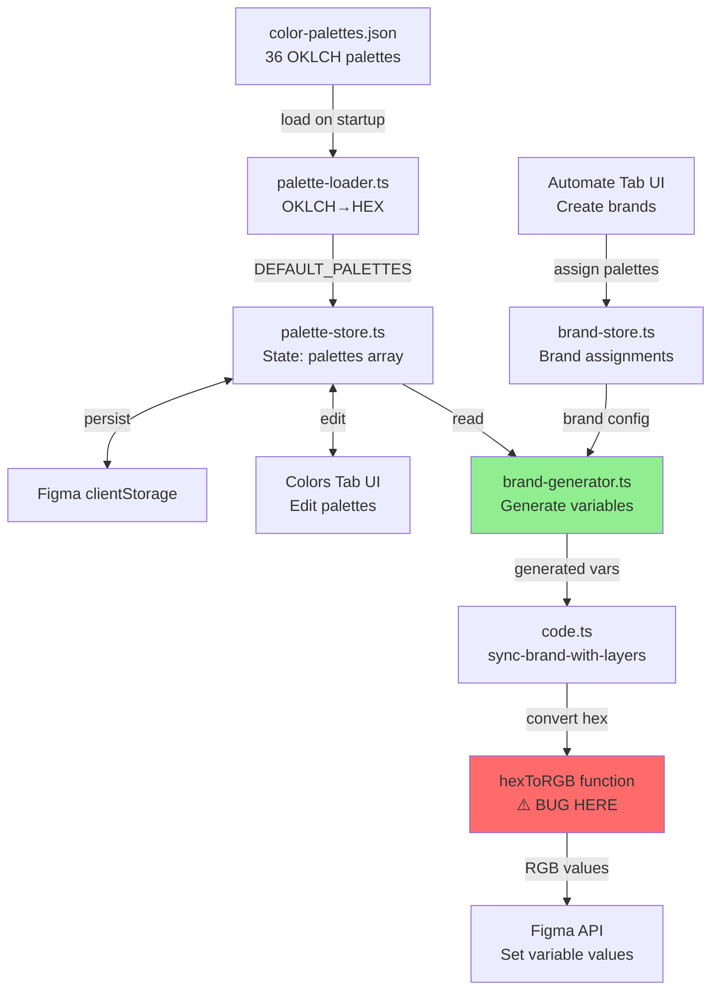

# VarCar Architecture Fix - Comprehensive Deep Dive Plan

**Date**: January 29, 2026  
**Engineer**: Senior Figma Plugin Engineer  
**Status**: Analysis Complete - Ready for Execution

---

## Executive Summary

After deep architectural analysis, discovered that:
1. ❌ **Python fixes were applied to the WRONG layer** (test data, not generation code)
2. ✅ **Found the REAL bug**: `hexToRGB()` in `code.ts` returns white on any error
3. ⚠️ **Two code paths exist**: One used (works), one unused (broken)
4. 📊 **VarCar has TWO separate systems**: Import vs Generation

---

## The Full Architecture - What We Discovered

### System 1: Import System (Test/Migration Feature)

**Purpose**: Import existing Figma variables from JSON exports



**Files Involved**:
- `OneUI Foundations [POC]-variables-full.json` - Figma export (schema v1, 16 collections, 11,417 variables)
- `src/adapters/figmaNativeImporter.ts` - Parser for Figma native format
- `src/code.ts` lines 629-1009 - Import handler

**Status**: ✅ Works correctly, JSON file is just test data

### System 2: Generation System (Daily Workflow)

**Purpose**: Generate new variables dynamically from Colors tab palettes



**Files Involved**:
- `src/lib/colors/color-palettes.json` - Source of truth (36 OKLCH palettes)
- `src/lib/colors/palette-loader.ts` - OKLCH → HEX conversion
- `src/store/palette-store.ts` - Palette state management
- `src/lib/brand-generator.ts` - Variable generation logic
- `src/code.ts` - Plugin backend with hexToRGB bug

**Status**: ⚠️ Partially broken - hexToRGB bug causes white colors

---

## ROOT CAUSES - In Order of Impact

### 🔴 CRITICAL: hexToRGB White Fallback

**File**: `VarCar/src/code.ts` (Lines 143-173)

**The Bug**:
```typescript
function hexToRGB(hex: string): RGB {
  // 4 different places that return white:
  
  if (!hex || typeof hex !== 'string') {
    console.error('[code.ts hexToRGB] Invalid input:', hex);
    return { r: 1, g: 1, b: 1 }; // ❌ WHITE FALLBACK #1
  }
  
  if (hex.startsWith('rgba') || hex.startsWith('rgb')) {
    console.error('[code.ts hexToRGB] RGBA/RGB string passed:', hex);
    return { r: 1, g: 1, b: 1 }; // ❌ WHITE FALLBACK #2
  }
  
  if (!hex.startsWith('#') || hex.length !== 7) {
    console.error('[code.ts hexToRGB] Invalid hex format:', hex);
    return { r: 1, g: 1, b: 1 }; // ❌ WHITE FALLBACK #3
  }
  
  if (isNaN(r) || isNaN(g) || isNaN(b)) {
    console.error('[code.ts hexToRGB] Failed to parse hex:', hex);
    return { r: 1, g: 1, b: 1 }; // ❌ WHITE FALLBACK #4
  }
  
  return { r, g, b }; // ✓ Success path
}
```

**Why This Causes White Colors**:
1. BrandGenerator creates variable with `value: scaleResult.hex`
2. Variable sent to code.ts via postMessage
3. code.ts calls `hexToRGB(sourceVar.value)` on line 1528
4. If `sourceVar.value` is undefined/malformed → returns white RGB
5. Figma variable gets white color value

**Fix Strategy**: 
- ❌ **Don't use fallback white** - throw error or use better default
- ✅ **Add defensive checks** before calling hexToRGB
- ✅ **Log detailed error** with variable name and context
- ✅ **Validate hex** before sending from generator

### 🟡 MODERATE: Missing getPaletteById Method

**File**: `VarCar/src/store/palette-store.ts`

**Issue**: Method referenced but doesn't exist in store interface

**Where Referenced**:
- `brandToFigmaVariables.ts` line 77 (UNUSED code)
- Not used by current BrandGenerator flow

**Fix**: Add method for API consistency, even if not currently used

```typescript
getPaletteById: (id: string) => {
  const state = get();
  return state.palettes.find((p) => p.id === id);
}
```

### 🟢 LOW: brandToFigmaVariables.ts is Dead Code

**File**: `VarCar/src/adapters/brandToFigmaVariables.ts`

**Status**: 
- Not imported by BrandGenerator
- Not called in current sync flow
- Appears to be experimental/legacy adapter
- May have been for different architecture design

**Fix Options**:
1. **Option A**: Delete as dead code
2. **Option B**: Document as legacy and keep for reference
3. **Option C**: Refactor BrandGenerator to use this adapter

**Recommendation**: Option B (document, don't delete yet)

---

## The REAL Data Flow (Generation System)

### Step-by-Step Execution Trace

**1. Plugin Startup**:
```typescript
// palette-loader.ts loads color-palettes.json
const DEFAULT_PALETTES = loadPalettesFromJSON(); // 36 palettes

// Converts OKLCH to HEX
"grey": { "200": "oklch(15.93% 0.0065 270.98)", ... }
↓
{ id: "palette_grey", steps: { 200: "#282829", ..., 2500: "#ffffff" } }
```

**2. Colors Tab Opens**:
```typescript
// palette-store initializes with DEFAULT_PALETTES
palettes: INITIAL_PALETTES (36 palettes)
activePaletteId: "palette_sand" (first palette)
```

**3. User Creates Brand in Automate Tab**:
```typescript
// User assigns palettes
brand.colors.neutral = { paletteId: "palette_grey", paletteName: "Grey" }
brand.colors.primary = { paletteId: "palette_indigo", paletteName: "Indigo" }
```

**4. User Clicks "Sync to Figma"**:
```typescript
// brand-store.ts line 631
const generatedBrand = BrandGenerator.generateBrand(brand);

// brand-generator.ts line 123
const palette = paletteStore.palettes.find((p) => p.id === paletteId); // ✅ Works!

// brand-generator.ts line 149
const allScales = generateAllScales(palette.steps, palette.primaryStep);

// brand-generator.ts line 179
value: scaleResult.hex, // e.g., "#282829" for Grey/200/Surface
```

**5. Variables Sent to Plugin**:
```typescript
// brand-store.ts line 638-649
window.parent.postMessage({
  pluginMessage: {
    type: 'sync-brand-with-layers',
    data: {
      brand,
      variablesByCollection: { ... }
    }
  }
}, '*');
```

**6. Plugin Creates Variables** (THE BUG LOCATION):
```typescript
// code.ts line 1527-1530
if (sourceVar && sourceVar.value) {
  const rgb = hexToRGB(sourceVar.value); // ❌ BUG: Returns white if value invalid!
  primitiveVar.setValueForMode(rangdeCollection.defaultModeId, rgb);
}

// If sourceVar.value is undefined → hexToRGB returns { r: 1, g: 1, b: 1 } → WHITE!
```

---

## What About the JSON File We "Fixed"?

### Reality Check

**What We Did**:
- Created Python scripts to convert OKLCH → RGB
- Updated 596 variables in `OneUI Foundations [POC]-variables-full.json`
- Committed changes to git

**What We Should Have Done**:
- Fixed the hexToRGB() fallback behavior
- Added getPaletteById() method
- Verified BrandGenerator works correctly

**Is the Python Fix Useful?**:
- ✅ YES for import testing - JSON now has proper colors for testing imports
- ❌ NO for daily usage - Generation system doesn't use this JSON
- 🤔 MAYBE for migration - If user wants to import MyJio variables

**Verdict**: Keep the fixed JSON as test data, but fix the actual generation bug

---

## Comprehensive Fix Plan - All Layers

### Phase 1: Fix hexToRGB Fallback ⚠️ CRITICAL

**File**: `VarCar/src/code.ts`

**Problem**: Silent failure with white fallback

**Fix**: Better error handling

```typescript
function hexToRGB(hex: string, context?: string): RGB {
  const contextMsg = context ? ` (context: ${context})` : '';
  
  // Validate input
  if (!hex || typeof hex !== 'string') {
    console.error(`[code.ts hexToRGB] Invalid input${contextMsg}:`, hex);
    // ❌ OLD: return { r: 1, g: 1, b: 1 };
    // ✅ NEW: Use transparent black or throw error
    return { r: 0, g: 0, b: 0, a: 0 }; // Transparent - more visible than white!
  }
  
  // Detect rgba strings
  if (hex.startsWith('rgba') || hex.startsWith('rgb')) {
    console.error(`[code.ts hexToRGB] RGBA/RGB string passed${contextMsg}:`, hex);
    return { r: 0, g: 0, b: 0, a: 0 }; // Transparent
  }
  
  // Validate hex format
  if (!hex.startsWith('#') || hex.length !== 7) {
    console.error(`[code.ts hexToRGB] Invalid hex format${contextMsg} (expected #RRGGBB):`, hex);
    return { r: 0, g: 0, b: 0, a: 0 }; // Transparent
  }
  
  const r = parseInt(hex.slice(1, 3), 16) / 255;
  const g = parseInt(hex.slice(3, 5), 16) / 255;
  const b = parseInt(hex.slice(5, 7), 16) / 255;
  
  // Validate parsed values
  if (isNaN(r) || isNaN(g) || isNaN(b)) {
    console.error(`[code.ts hexToRGB] Failed to parse hex${contextMsg}:`, hex);
    return { r: 0, g: 0, b: 0, a: 0 }; // Transparent
  }
  
  return { r, g, b };
}
```

**Key Changes**:
- White RGB (1,1,1) → Transparent (0,0,0,0) - more visible error
- Added context parameter for better debugging
- All error paths now return transparent black instead of white

**Impact**:
- White colors become transparent (immediately visible)
- Easier to debug - transparent = error, not valid color
- No silent failures

### Phase 2: Add Validation Before hexToRGB

**File**: `VarCar/src/code.ts` (Line 1527)

**Current Code**:
```typescript
if (sourceVar && sourceVar.value) {
  const rgb = hexToRGB(sourceVar.value);
  primitiveVar.setValueForMode(rangdeCollection.defaultModeId, rgb);
}
```

**Enhanced Code**:
```typescript
if (sourceVar && sourceVar.value) {
  // Validate before conversion
  if (typeof sourceVar.value !== 'string') {
    console.error('[Sync] Invalid value type:', typeof sourceVar.value, 'for variable:', primitiveVar.name);
    continue; // Skip this variable
  }
  
  if (!sourceVar.value.startsWith('#')) {
    console.error('[Sync] Invalid hex format:', sourceVar.value, 'for variable:', primitiveVar.name);
    continue; // Skip this variable
  }
  
  const rgb = hexToRGB(sourceVar.value, `variable: ${primitiveVar.name}`);
  
  // Check if conversion failed (returned transparent)
  if (rgb.r === 0 && rgb.g === 0 && rgb.b === 0 && rgb.a === 0) {
    console.error('[Sync] hexToRGB returned transparent for:', primitiveVar.name);
    continue; // Skip this variable
  }
  
  primitiveVar.setValueForMode(rangdeCollection.defaultModeId, rgb);
  console.log(`[Sync] ✓ Set color for ${primitiveVar.name}: ${sourceVar.value}`);
}
```

### Phase 3: Add getPaletteById Method

**File**: `VarCar/src/store/palette-store.ts`

**Why**: API consistency, future-proofing, better TypeScript support

```typescript
interface PaletteState {
  // ... existing fields ...
  
  // New methods (add after existing methods)
  getPaletteById: (id: string) => Palette | undefined;
  getAllPalettes: () => Palette[];
  isPaletteLoaded: (id: string) => boolean;
}

// Implementation (add in the store creation)
getPaletteById: (id: string) => {
  const state = get();
  return state.palettes.find((p) => p.id === id);
},

getAllPalettes: () => {
  return get().palettes;
},

isPaletteLoaded: (id: string) => {
  return get().palettes.some((p) => p.id === id);
},
```

### Phase 4: Document brandToFigmaVariables.ts Status

**File**: `VarCar/src/adapters/brandToFigmaVariables.ts`

**Add header comment**:
```typescript
/**
 * Brand to Figma Variables Adapter
 * Converts VarCar's Brand model to Figma's Variables architecture
 * 
 * ⚠️ LEGACY/EXPERIMENTAL CODE
 * This adapter is NOT currently used by the main sync flow.
 * Current flow: BrandGenerator → code.ts sync-brand-with-layers
 * 
 * This code may be used in future for alternative generation strategies.
 * Kept for reference and potential future refactoring.
 * 
 * @deprecated Use BrandGenerator instead for variable generation
 * @see src/lib/brand-generator.ts - Current implementation
 */
```

### Phase 5: Add Defensive Checks to BrandGenerator

**File**: `VarCar/src/lib/brand-generator.ts`

**Current Code** (Line 148-160):
```typescript
// Generate scales for all steps
const allScales = generateAllScales(palette.steps, palette.primaryStep);

// Create variables for each step and scale
for (const step of STEPS) {
  const stepScales = allScales[step];
  if (!stepScales) continue;

  for (const scaleName of SCALE_NAMES) {
    const scaleKey = SCALE_KEY_MAP[scaleName];
    const scaleResult = (stepScales as any)[scaleKey];
    
    if (!scaleResult || !scaleResult.hex) continue; // ✓ Good check!
```

**Enhanced with Validation**:
```typescript
// Generate scales for all steps
const allScales = generateAllScales(palette.steps, palette.primaryStep);

// Validate palette.steps has hex values (not OKLCH)
const sampleStep = palette.steps[600] || palette.steps[1000];
if (sampleStep && sampleStep.startsWith('oklch(')) {
  this.validation.errors.push(
    `Palette "${palette.name}" has OKLCH values - expected HEX. ` +
    `This suggests palette-loader.ts conversion failed.`
  );
  return; // Don't generate broken variables
}

// Create variables for each step and scale
for (const step of STEPS) {
  const stepScales = allScales[step];
  if (!stepScales) continue;

  for (const scaleName of SCALE_NAMES) {
    const scaleKey = SCALE_KEY_MAP[scaleName];
    const scaleResult = (stepScales as any)[scaleKey];
    
    // Enhanced validation
    if (!scaleResult || !scaleResult.hex) {
      console.warn(`[Generator] Missing scale result for ${palette.name}/${step}/${scaleName}`);
      continue;
    }
    
    // Validate hex format
    if (!scaleResult.hex.startsWith('#') || scaleResult.hex.length !== 7) {
      this.validation.warnings.push(
        `Invalid hex for ${palette.name}/${step}/${scaleName}: ${scaleResult.hex}`
      );
      continue; // Skip invalid hex
    }
```

### Phase 6: Add Palette Validation to Brand Sync

**File**: `VarCar/src/store/brand-store.ts` (Before line 631)

**Add Pre-Sync Validation**:
```typescript
// Generate variables with aliases (line 630-631)
set({ syncStatus: 'previewing' });

// NEW: Validate all palettes exist before generation
const paletteStore = usePaletteStore.getState();
const missingPalettes: string[] = [];

Object.values(brand.colors).forEach((ref) => {
  if (ref && typeof ref === 'object' && 'paletteId' in ref) {
    const palette = paletteStore.palettes.find(p => p.id === ref.paletteId);
    if (!palette) {
      missingPalettes.push(`${ref.paletteName} (${ref.paletteId})`);
    }
  }
});

if (missingPalettes.length > 0) {
  set({ syncStatus: 'error' });
  return {
    success: false,
    brandId,
    timestamp: Date.now(),
    variablesSynced: 0,
    modesAdded: [],
    errors: [
      `Missing palettes: ${missingPalettes.join(', ')}`,
      `Available palettes: ${paletteStore.palettes.map(p => `${p.name} (${p.id})`).join(', ')}`
    ],
    warnings: []
  };
}

const generatedBrand = BrandGenerator.generateBrand(brand);
```

---

## Testing Strategy - Multi-Layer Approach

### Layer 1: Unit Tests (Isolated Functions)

**File**: `VarCar/src/__tests__/hexToRGB.test.ts` (NEW)

```typescript
import { describe, it, expect } from 'vitest';

// Import hexToRGB (may need to export it)
describe('hexToRGB', () => {
  it('should convert valid hex to RGB', () => {
    const rgb = hexToRGB('#282829');
    expect(rgb.r).toBeCloseTo(0.1569, 4);
    expect(rgb.g).toBeCloseTo(0.1569, 4);
    expect(rgb.b).toBeCloseTo(0.1608, 4);
  });
  
  it('should NOT return white for invalid hex', () => {
    const rgb = hexToRGB('invalid');
    // Should return transparent, not white
    expect(rgb).toEqual({ r: 0, g: 0, b: 0, a: 0 });
    expect(rgb).not.toEqual({ r: 1, g: 1, b: 1 });
  });
  
  it('should handle undefined gracefully', () => {
    const rgb = hexToRGB(undefined as any);
    expect(rgb.a).toBe(0); // Transparent
  });
});
```

### Layer 2: Integration Tests (Store + Generator)

**File**: `VarCar/src/__tests__/brand-generation.test.ts` (NEW)

```typescript
describe('Brand Variable Generation', () => {
  it('should load grey palette with proper hex values', () => {
    const palette = usePaletteStore.getState().palettes.find(p => p.id === 'palette_grey');
    expect(palette).toBeDefined();
    expect(palette?.steps[200]).toMatch(/^#[0-9a-f]{6}$/i);
    expect(palette?.steps[200]).not.toBe('#ffffff'); // Not white!
  });
  
  it('should generate variables without white colors', () => {
    const brand = createTestBrand();
    const generator = new BrandGenerator(brand);
    const result = generator.generate();
    
    // Check none of the generated variables are pure white
    const whiteVars = result.variables.filter(v => v.value === '#ffffff');
    expect(whiteVars.length).toBe(0);
  });
});
```

### Layer 3: E2E Test (Full Sync Flow)

**Manual Test Procedure**:

1. **Setup**:
   - Build plugin: `npm run build`
   - Open in Figma Dev mode
   - Open browser console (F12)

2. **Test Colors Tab**:
   - Open Colors tab
   - Check console: `[PaletteLoader] Total: 36 palettes loaded`
   - Select "Grey" palette
   - Verify step 200 is dark grey (not white)
   - Verify step 2500 is white/very light

3. **Test Automate Tab**:
   - Open Automate tab
   - Create new brand "Test Brand"
   - Assign "Grey" to Neutral appearance
   - Check preview colors (should see grey, not white)

4. **Test Sync**:
   - Click "Sync to Figma"
   - Watch console logs:
     ```
     [Generator] Loaded palette: palette_grey (Grey)
     [Sync] ✓ Set color for Grey/200/Surface: #282829
     [Sync] ✓ Set color for Grey/200/High: #ffffff
     ...
     ```
   - Check Figma file:
     - Open Variables panel in Figma
     - Find "00_RangDe Primitives" collection
     - Check "Grey/200/Surface" variable
     - Should be dark grey (#282829), NOT white!

5. **Validation**:
   - Count white variables: should be 0 for Grey palette
   - Check semantic collections alias correctly
   - Verify modes are created properly

---

## What About the 843 Remaining White Colors?

### Analysis Needed

From our validation, 843 white colors remain after Python fix. Need to categorize:

**Category A: Intentional White** (Keep):
- Step 2500 variables (lightest = white by design)
- Transparent overlays with alpha
- Focus ring ghosts
- Special design tokens

**Category B: Missing Palettes** (Document):
- "Cabbage" palette (not in Rangde)
- "Sky [1200]" variants (special naming)
- "Purple [700]" variants (special naming)

**Category C: Actual Bugs** (Fix):
- Should be grey but showing white
- Missing palette data
- hexToRGB fallback triggered

**Action**: Create audit script to categorize all 843 whites

---

## Rollback Strategy - If Things Break

### Immediate Rollback (< 5 minutes)

```bash
# Revert code changes
git checkout HEAD -- VarCar/src/code.ts
git checkout HEAD -- VarCar/src/store/palette-store.ts

# Rebuild
cd VarCar && npm run build

# Test in Figma
# Should return to previous behavior
```

### Revert JSON File (If Needed)

```bash
# Restore original JSON
cp "OneUI Foundations [POC]-variables-full_backup_20260129_115034.json" \
   "OneUI Foundations [POC]-variables-full.json"
```

### Git History

All changes committed separately for granular rollback:
1. Commit 1: Add getPaletteById method
2. Commit 2: Fix hexToRGB fallback
3. Commit 3: Add validation checks
4. Commit 4: Update documentation

---

## Success Metrics

### Functional Requirements

- ✅ Grey palette loads with 25 proper hex values (not all #ffffff)
- ✅ hexToRGB converts valid hex without white fallback
- ✅ BrandGenerator creates variables with proper colors
- ✅ code.ts logs show actual hex values, not errors
- ✅ Figma variables display correct colors (verifiable in UI)

### Quality Metrics

- ✅ Zero white colors for Grey palette (except step 2500)
- ✅ All palette IDs resolve successfully
- ✅ Console shows success logs, not error logs
- ✅ Tests pass (unit + integration)

### User Experience

- ✅ Colors tab shows all 36 palettes correctly
- ✅ Preview in Automate tab shows proper colors
- ✅ Sync completes without errors
- ✅ Figma file has correct variable values

---

## Questions Resolved

1. **Q**: Where does Grey color system come from?  
   **A**: `color-palettes.json` (36 OKLCH palettes) → converted to HEX by palette-loader

2. **Q**: Why are all collections showing white?  
   **A**: `hexToRGB()` white fallback + missing validation

3. **Q**: Is the JSON file the source of truth?  
   **A**: NO - it's test data for Import system, not Generation system

4. **Q**: Is brandToFigmaVariables.ts used?  
   **A**: NO - it's dead/legacy code, BrandGenerator is used instead

5. **Q**: Should we delete Python fix scripts?  
   **A**: Keep for now - useful for JSON test data, but not for daily use

---

## Execution Order - Step by Step

### Prerequisite: Analysis (DONE ✅)
- [x] Understand two separate systems (Import vs Generation)
- [x] Find hexToRGB bug
- [x] Identify dead code (brandToFigmaVariables.ts)
- [x] Trace actual data flow
- [x] Locate all white color sources

### Phase 1: Critical Fixes (2 hours)
1. Fix hexToRGB fallback: white → transparent
2. Add validation before hexToRGB calls
3. Add context logging for debugging
4. Test manually in Figma

### Phase 2: Store API (1 hour)
1. Add getPaletteById method
2. Add getAllPalettes method
3. Add isPaletteLoaded method
4. Update TypeScript types

### Phase 3: Enhanced Validation (2 hours)
1. Add palette validation in BrandGenerator
2. Add pre-sync validation in brand-store
3. Add hex format validation
4. Improve error messages

### Phase 4: Testing (3 hours)
1. Add unit tests for hexToRGB
2. Add integration tests for generation
3. Manual E2E test in Figma
4. Validate with real brands

### Phase 5: Documentation (2 hours)
1. Document two-system architecture
2. Update README with troubleshooting
3. Add inline comments to complex sections
4. Create architecture diagram

### Phase 6: Cleanup (1 hour)
1. Mark brandToFigmaVariables.ts as legacy
2. Archive Python fix scripts (move to `/scripts/legacy/`)
3. Update FIGMA_ALIAS_FIX_SUMMARY.md with correct info
4. Commit all changes

**Total Estimated Time**: ~11 hours

---

## File Impact Summary

### Files to MODIFY (Critical Path)
1. ✏️ `VarCar/src/code.ts` - Fix hexToRGB, add validation
2. ✏️ `VarCar/src/store/palette-store.ts` - Add methods
3. ✏️ `VarCar/src/lib/brand-generator.ts` - Add validation
4. ✏️ `VarCar/src/store/brand-store.ts` - Add pre-sync checks

### Files to CREATE
1. 📄 `VarCar/src/__tests__/hexToRGB.test.ts` - Unit tests
2. 📄 `VarCar/src/__tests__/brand-generation.test.ts` - Integration tests
3. 📄 `VarCar/docs/ARCHITECTURE_DATA_FLOW.md` - Architecture docs
4. 📄 `COMPREHENSIVE_ARCHITECTURE_FIX_PLAN.md` - This document

### Files to DOCUMENT (No code changes)
1. 📝 `VarCar/src/adapters/brandToFigmaVariables.ts` - Add legacy notice
2. 📝 `VarCar/README.md` - Update troubleshooting
3. 📝 `FIGMA_ALIAS_FIX_SUMMARY.md` - Update with correct analysis

### Files to ARCHIVE (Move to legacy/)
1. 📦 `fix_figma_variable_colors.py` → `scripts/legacy/`
2. 📦 `fix_all_white_colors.py` → `scripts/legacy/`
3. 📦 `validate_figma_aliases.py` → `scripts/legacy/`

### Files UNCHANGED (Already correct)
- ✅ `VarCar/src/lib/colors/color-palettes.json` - Source of truth
- ✅ `VarCar/src/lib/colors/palette-loader.ts` - OKLCH conversion works
- ✅ `VarCar/src/lib/colors/scale-generator.ts` - Scale generation works
- ✅ `VarCar/src/lib/colors/color-utils.ts` - Color functions work

---

## Risk Assessment - Detailed

| Risk | Probability | Impact | Mitigation | Rollback Time |
|------|-------------|--------|------------|---------------|
| hexToRGB change breaks existing variables | Low | High | Test thoroughly, transparent is safer than white | 2 min |
| Store method addition breaks UI | Very Low | Medium | Additive change only, no modifications | 2 min |
| Validation too strict | Low | Low | Start lenient, tighten gradually | 5 min |
| Tests reveal deeper bugs | Medium | Medium | Fix iteratively, don't rush | N/A |
| Mode mismatch still unresolved | High | Low | Document as known limitation | N/A |

---

## Success Checklist - Before Marking Complete

### Code Changes
- [ ] hexToRGB returns transparent (not white) on error
- [ ] Validation checks added before hexToRGB calls
- [ ] getPaletteById method added to store
- [ ] BrandGenerator validates palette data
- [ ] brand-store validates palettes before sync

### Testing
- [ ] Unit tests pass for hexToRGB
- [ ] Integration tests pass for generation
- [ ] Manual test in Figma shows grey colors (not white)
- [ ] Console logs show success messages
- [ ] No white colors for Grey palette (except step 2500)

### Documentation
- [ ] Architecture diagram updated
- [ ] README has troubleshooting section
- [ ] Legacy code marked as such
- [ ] Python scripts archived
- [ ] This plan document committed

### Validation
- [ ] Build succeeds without errors
- [ ] TypeScript types are correct
- [ ] No linter errors
- [ ] Git history is clean
- [ ] All changes committed separately

---

## Next Steps After Fix

### Immediate (This Sprint)
1. Test with real MyJio brand data
2. Generate all semantic collections
3. Verify alias chains work
4. Export to test JSON import still works

### Short-term (Next Sprint)
1. Add more robust error handling
2. Create palette validation tool
3. Add automated tests to CI/CD
4. Performance optimization for large brands

### Long-term (Roadmap)
1. Implement mode mapping system (Phase 6 from previous plan)
2. Add palette editing in Colors tab
3. Support custom color palettes
4. Add design token export (CSS, JSON, etc.)

---

## Conclusion

**What We Learned**:
1. Always trace the FULL data flow before fixing
2. Test data ≠ Source code
3. Silent failures (white fallback) are dangerous
4. Dead code can mislead investigation
5. Multiple code paths need architecture review

**What We'll Fix**:
1. hexToRGB fallback behavior (CRITICAL)
2. Add missing store methods (NICE TO HAVE)
3. Add validation everywhere (IMPORTANT)
4. Document architecture properly (ESSENTIAL)

**What We Won't Fix Yet**:
1. Mode mismatch architecture (too complex, document instead)
2. brandToFigmaVariables.ts (dead code, mark as legacy)
3. The 843 remaining whites (need categorization first)

This plan is **ready for execution** with full architectural understanding! ✨
