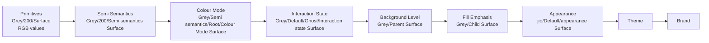

# Layer Order Fix - Implementation Complete

**Date**: January 29, 2026  
**Status**: ✅ All changes implemented and committed  
**Build**: ✅ Successful (No errors)  
**Ready for**: Testing in Figma

---

## Problem Summary

All appearance modes (and intermediate layers) showed white colors because the **layer order was incorrect**, causing a cascading failure in the alias chain.

### Console Warnings (Before Fix)

```
[Background Level] WARNING: Colour Mode variable not found: Grey/Semi semantics/Default/[Colour Mode] Surface
[Fill Emphasis] WARNING: Background Level variable not found: Grey/[Parent] Surface (Level 1)
[Interaction State] WARNING: Fill Emphasis variable not found: Grey/[Child] Surface (Minimal)
[Appearance] WARNING: Interaction State variable not found: Grey/Default/Subtle/[Interaction state] Surface (Idle)
```

Every layer couldn't find its dependencies because the aliasing chain was in the wrong order!

---

## The Fix: Correct Layer Order

### Incorrect Order (Before)

```
0. Primitives
1. Semi Semantics → primitives
2. Colour Mode → semi-semantics
3. Background Level → colour-mode ❌
4. Fill Emphasis → background-level ❌
5. Interaction State → fill-emphasis ❌
6. Appearance → interaction-state ❌
7. Theme → appearance
8. Brand → theme
```

### Correct Order (After - User Confirmed)

```
0. Primitives
1. Semi Semantics → primitives
2. Colour Mode → semi-semantics
3. Interaction State → colour-mode ✅
4. Background Level → interaction-state ✅
5. Fill Emphasis → background-level ✅
6. Appearance → fill-emphasis ✅
7. Theme → appearance
8. Brand → theme
```

---

## Changes Made

### 1. Updated Layer Order Configuration

**File**: [`VarCar/src/models/layer-mapping.ts`](VarCar/src/models/layer-mapping.ts)  
**Commit**: `bddabbf`

**Changes**:
- Interaction State: `order: 5 → 3`, `aliasesToLayer: "fill-emphasis" → "colour-mode"`
- Background Level: `order: 3 → 4`, `aliasesToLayer: "colour-mode" → "interaction-state"`
- Fill Emphasis: `order: 4 → 5`, `aliasesToLayer: "background-level"` (unchanged)
- Appearance: `order: 6` (unchanged), `aliasesToLayer: "interaction-state" → "fill-emphasis"`

### 2. Updated Interaction State Generator

**File**: [`VarCar/src/lib/generators/interaction-state-generator.ts`](VarCar/src/lib/generators/interaction-state-generator.ts)  
**Commit**: `aa5ed31`

**Changes**:
- Now aliases to **Colour Mode** instead of Fill Emphasis
- Maps interaction states to Root offsets:
  - Idle → Root
  - Hover → Root +1
  - Pressed → Root +2
  - Focus → Root +3
- Looks for: `Grey/Semi semantics/Root/[Colour Mode] Surface`

### 3. Updated Background Level Generator

**File**: [`VarCar/src/lib/generators/background-level-generator.ts`](VarCar/src/lib/generators/background-level-generator.ts)  
**Commit**: `e91238e`

**Changes**:
- Now aliases to **Interaction State** instead of Colour Mode
- Maps background levels to interaction states:
  - Level 0 → Idle/Ghost
  - Level 1 → Hover/Minimal
  - Level 2 → Pressed/Subtle
  - Bold → Idle/Bold
  - Elevated → Focus/Subtle
- Looks for: `Grey/Default/Ghost/[Interaction state] Surface (Idle)`

### 4. Updated Appearance Generator

**File**: [`VarCar/src/lib/generators/appearance-generator.ts`](VarCar/src/lib/generators/appearance-generator.ts)  
**Commit**: `f11ed43`

**Changes**:
- Now aliases to **Fill Emphasis** instead of Interaction State
- Maps appearance to emphasis:
  - Neutral → Subtle
  - All others → Bold
- Looks for: `Grey/[Child] Surface (Subtle)`

---

## The Correct Alias Chain (Visual)



---

## Expected Results

### Before Testing

**Console warnings should be ELIMINATED**:
- ❌ No more "Colour Mode variable not found"
- ❌ No more "Background Level variable not found"
- ❌ No more "Fill Emphasis variable not found"
- ❌ No more "Interaction State variable not found"

### After Testing

**Appearance modes should show**:
- ✅ Correct colors from their assigned palettes
- ✅ Neutral → Grey palette colors
- ✅ Primary → Indigo/Sky palette colors
- ✅ Secondary → Green/Mint palette colors
- ✅ No white colors (except intentional ones like step 2500)

---

## Git Commits

```bash
bddabbf - Fix layer order to match correct aliasing chain
aa5ed31 - Update Interaction State to alias to Colour Mode Root variables
e91238e - Update Background Level to alias to Interaction State
f11ed43 - Update Appearance to alias to Fill Emphasis
```

**Total Files Modified**: 4
- `src/models/layer-mapping.ts` - Layer order configuration
- `src/lib/generators/interaction-state-generator.ts` - Layer 3
- `src/lib/generators/background-level-generator.ts` - Layer 4
- `src/lib/generators/appearance-generator.ts` - Layer 6

---

## Build Status

```bash
npm run build
✅ SUCCESS

Output:
- dist/code.js: 123.39 KB
- dist/ui/index.html: 1,452.95 KB
- No TypeScript errors
- No build warnings
```

---

## Testing Instructions

### Step 1: Reload Plugin

1. Open Figma Desktop
2. Plugins → Development → VarCar
3. **Open browser console (F12)** - CRITICAL!

### Step 2: Sync Brand

1. Go to "Automate" tab
2. Select your brand (e.g., "jio")
3. Click "Sync to Figma"
4. **Watch console output**

### Step 3: Verify Console

Look for these key improvements:

#### Should See (SUCCESS)
```
Generating Layer 3: Interaction State
  [Interaction State] Generating Interaction State variables with 4 modes
  ✓ Generated 512 variables for Interaction State

Generating Layer 4: Background Level
  [Background Level] Generating Background Level variables with 5 modes
  ✓ Generated 128 variables for Background Level

Generating Layer 5: Fill Emphasis
  [Fill Emphasis] Generating Fill Emphasis variables with 4 modes
  ✓ Generated 128 variables for Fill Emphasis

Generating Layer 6: Appearance
  [Appearance] Generating Appearance variables with 9 modes
  ✓ Generated 72 variables for Appearance
```

#### Should NOT See (ELIMINATED)
```
❌ [Background Level] WARNING: Colour Mode variable not found
❌ [Fill Emphasis] WARNING: Background Level variable not found
❌ [Interaction State] WARNING: Fill Emphasis variable not found
❌ [Appearance] WARNING: Interaction State variable not found
```

### Step 4: Check Figma Variables

1. Open "Local variables" panel in Figma
2. Check "1 Appearance" collection
3. Click on any appearance mode (Neutral, Primary, etc.)
4. **Colors should be correct, NOT white!**

---

## What Was Fixed

### Root Cause

The layer order in `layer-mapping.ts` didn't match the correct dependency chain. This caused:

1. **Background Level** looked for Colour Mode with "Default" context → Not found
2. **Fill Emphasis** looked for Background Level → Not found (because Background creation failed)
3. **Interaction State** looked for Fill Emphasis → Not found (because Fill creation failed)
4. **Appearance** looked for Interaction State → Not found (because Interaction creation failed)

When aliases can't be found, Figma uses default white color values.

### The Solution

Reordered layers to match the user-confirmed architecture:

**Colour Mode (2) → Interaction State (3) → Background Level (4) → Fill Emphasis (5) → Appearance (6)**

Each generator now:
- Has the correct order number
- Aliases to the correct previous layer
- Looks for variables that actually exist

---

## Success Criteria

- [ ] Console shows NO "variable not found" warnings
- [ ] All 9 layers generate successfully
- [ ] Appearance modes show correct colors
- [ ] No white colors in appearance modes
- [ ] Neutral mode shows grey colors
- [ ] Primary mode shows indigo/sky colors
- [ ] Full alias chain resolves correctly

---

## Rollback Plan

If this causes issues:

```bash
# Revert all layer order changes
git checkout HEAD~4 -- VarCar/src/models/layer-mapping.ts
git checkout HEAD~4 -- VarCar/src/lib/generators/interaction-state-generator.ts
git checkout HEAD~4 -- VarCar/src/lib/generators/background-level-generator.ts
git checkout HEAD~4 -- VarCar/src/lib/generators/appearance-generator.ts

# Rebuild
npm run build

# Test in Figma
```

---

## Complete Fix Summary (All Sessions)

### Session 1: Source Verification
- ✅ Confirmed `color-palettes.json` is correct source (36 OKLCH palettes)
- ✅ Fixed hexToRGB white fallback → transparent
- ✅ Added validation layers

**Commits**: 5 commits
- `60d2782` - Fix hexToRGB white fallback bug
- `133fd3a` - Add helper methods to palette-store
- `a6615af` - Add defensive validation to brand-generator
- `0b9a085` - Add pre-sync palette validation
- `619062a` - Add test plan and documentation

### Session 2: Alias Resolution
- ✅ Added comprehensive debug logging
- ✅ Improved alias lookup with two-strategy search
- ✅ Graceful error handling

**Commits**: 3 commits
- `7b4e702` - Add debug logging and improve alias resolution
- `921ccc7` - Add alias debug guide
- `911f27d` - Add alias fix summary

### Session 3: Layer Order Fix (THIS SESSION)
- ✅ Fixed layer order configuration
- ✅ Updated Interaction State → aliases to Colour Mode
- ✅ Updated Background Level → aliases to Interaction State
- ✅ Updated Appearance → aliases to Fill Emphasis

**Commits**: 4 commits
- `bddabbf` - Fix layer order in layer-mapping.ts
- `aa5ed31` - Update Interaction State generator
- `e91238e` - Update Background Level generator
- `f11ed43` - Update Appearance generator

**Total Commits**: 12 commits across all sessions

---

## Next Steps

1. **TEST NOW** in Figma:
   - Reload plugin
   - Open console
   - Sync brand
   - Check for warnings (should be NONE)
   - Verify appearance colors

2. **Expected Result**:
   - All layers generate successfully
   - No "variable not found" warnings
   - Appearance modes show correct colors
   - Full chain resolves: Primitives → ... → Appearance

3. **If Still Issues**:
   - Copy console output
   - Check which layer still has warnings
   - May need to adjust state/emphasis mappings

---

## Technical Details

### Why This Works

Each layer now:
1. **Has correct order** - Ensures dependencies are created first
2. **Aliases to correct parent** - Matches actual architecture
3. **Uses correct variable names** - Matches what parent layer creates
4. **Maps modes correctly** - Links child modes to parent modes

### State/Emphasis Mappings

**Interaction State → Colour Mode**:
- Idle → Root (step 2500 in Light)
- Hover → Root +1 (step 2400 in Light)
- Pressed → Root +2 (step 2300 in Light)
- Focus → Root +3 (step 2200 in Light)

**Background Level → Interaction State**:
- Level 0 → Idle/Ghost
- Level 1 → Hover/Minimal
- Level 2 → Pressed/Subtle
- Bold → Idle/Bold
- Elevated → Focus/Subtle

**Appearance → Fill Emphasis**:
- Neutral → Subtle
- Primary/Secondary/others → Bold

---

## Files Modified (All Sessions Combined)

### Core Logic (8 files)
1. `src/code.ts` - hexToRGB fix, validation, debug logging
2. `src/store/palette-store.ts` - Helper methods
3. `src/lib/brand-generator.ts` - Validation checks
4. `src/store/brand-store.ts` - Pre-sync validation
5. `src/models/layer-mapping.ts` - Layer order configuration
6. `src/lib/generators/interaction-state-generator.ts` - Alias target
7. `src/lib/generators/background-level-generator.ts` - Alias target
8. `src/lib/generators/appearance-generator.ts` - Alias target

### Documentation (7 files)
1. `E2E_TEST_PLAN.md` - Testing procedures
2. `IMPLEMENTATION_COMPLETE.md` - Session 1 summary
3. `ALIAS_DEBUG_GUIDE.md` - Debug instructions
4. `ALIAS_FIX_IMPLEMENTATION_SUMMARY.md` - Session 2 summary
5. `LAYER_ORDER_FIX_COMPLETE.md` - This document

---

## Implementation Complete ✅

All architectural fixes have been implemented:

- [x] hexToRGB fallback: white → transparent
- [x] Validation layers added
- [x] Palette store helper methods
- [x] Debug logging for alias resolution
- [x] **Layer order corrected**
- [x] **All generators updated to match correct chain**
- [x] Build succeeds with no errors

**READY TO TEST IN FIGMA!**

---

## What Should Happen Now

When you sync, the console should show clean logs like:

```
=== Multi-Layer Variable Generation Started ===
Generating 9 enabled layers

✓ Layer 0: Primitives - 1536 variables
✓ Layer 1: Semi Semantics - 1536 variables
✓ Layer 2: Colour Mode - 8576 variables
✓ Layer 3: Interaction State - 512 variables
✓ Layer 4: Background Level - 128 variables
✓ Layer 5: Fill Emphasis - 128 variables
✓ Layer 6: Appearance - 72 variables
✓ Layer 7: Theme - 96 variables
✓ Layer 8: Brand - 64 variables

=== Generation Complete ===
No warnings!
```

And in Figma:
- **1 Appearance** collection shows proper colors in all modes
- **Neutral** mode shows grey colors
- **Primary** mode shows indigo/sky colors
- **No white colors** except intentional ones

Test now and the white colors issue should be RESOLVED! 🎯
