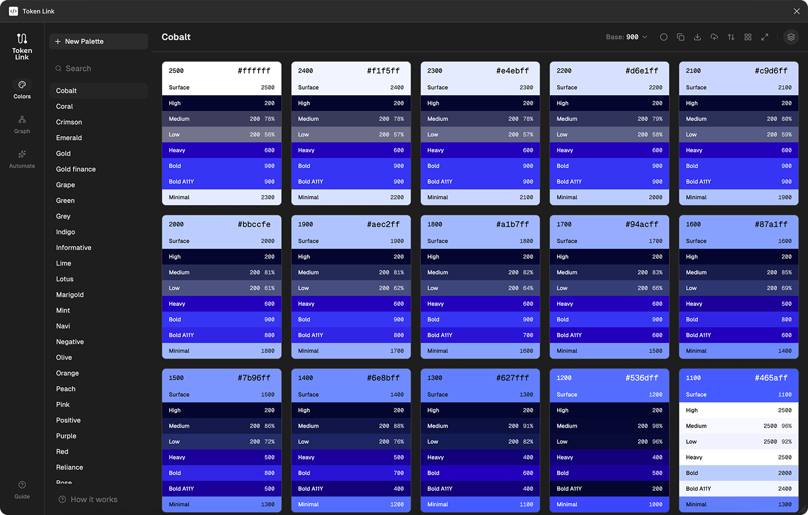
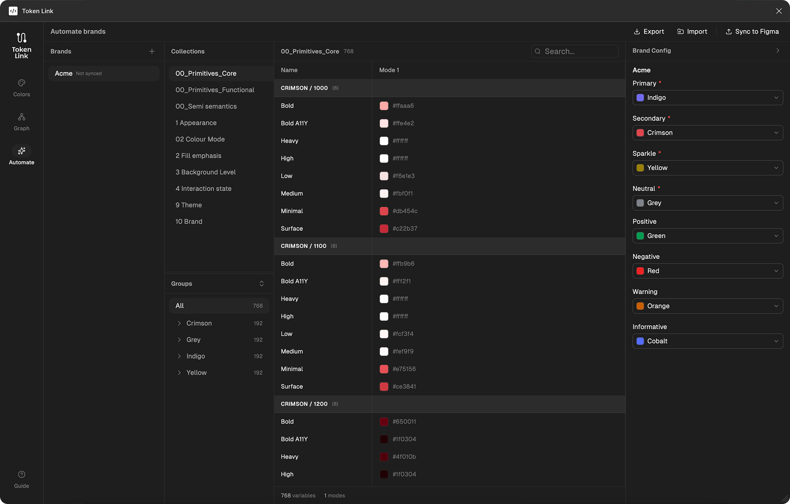
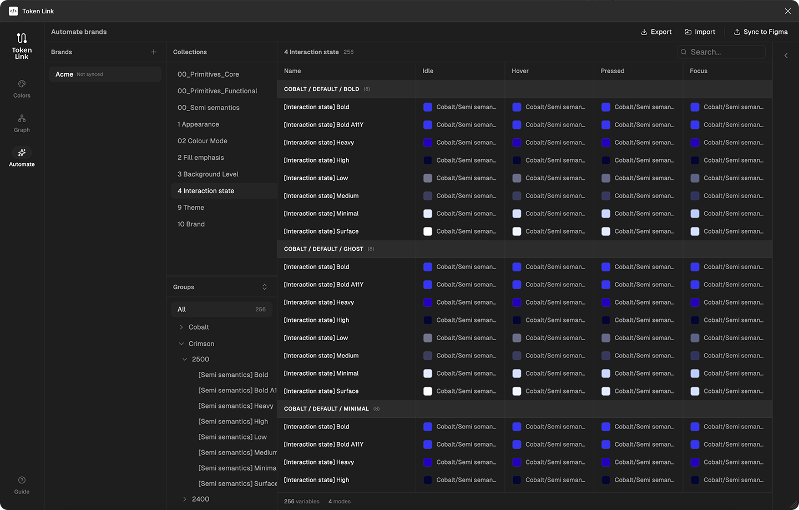

# Token Link

A Figma plugin for **design system designers and design ops** that automates creation and management of **Figma Variables** (design tokens).  
**Rules Engine × Token Compiler × Color Scale Generator** — all inside Figma.

---

## What Token Link Does

Token Link combines:

- **Rule-based aliasing** — batch mapping across collections and modes
- **Intelligent color scale generation** — WCAG-aware scales (Surface, High, Medium, Low, Heavy, Bold, Bold A11Y, Minimal) from a single palette
- **Brand automation** — generate 2,600+ variables across 9 collections from brand palettes
- **Export / import** — round-trip JSON and Figma’s native variable export format

---

## Problem It Solves

- Design systems have **thousands of color variables**, many collections (Primitives, Semantic, Interaction, Brand, Theme), nested groups, and multiple modes (Light/Dark, states).
- Managing **aliasing across collections, groups, and modes** in Figma is **manual, error-prone, and doesn’t scale**.
- There is **no native Figma workflow** for rule-based aliasing, batch mapping, or visual dependency management.

Token Link enables **rule-based aliasing**, automates **collection → group → mode** mappings, and exports a **structured JSON** of tokens.

---

## Product Overview

The UI is organized around a navigation rail with three main areas:

| Area | Description |
|------|-------------|
| **Colors** | Palette management, 8-scale color generation with WCAG contrast, and surface stacking preview (e.g. buttons, states). |
| **Automate** | Brand-driven automation: define brands, attach palettes, generate ~2,600 variables in 9 collections (Layer 0–8), sync to Figma, and import (Figma native or FigZig JSON). Includes rules engine, manual aliasing, and export/import. |
| **Guide** | In-plugin documentation (overview, variable mapping, layer system, workflow). |

### Screenshots

**Colors** — 8-scale grid (Cobalt palette): palette sidebar and main grid with step swatches, each showing all 8 scales (Surface, High, Medium, Low, Heavy, Bold, Bold A11Y, Minimal).

**Automate** — Brands, collections, token table, and Brand Config (semantic color mapping).

**Automate — Interaction state** (Idle, Hover, Pressed, Focus; 256 variables, 4 modes).

---

## How the Color System Works

You define a **palette** (steps 200–2500). For each **surface step**, the plugin generates **8 semantic scales**:

- **Surface** — base; others are relative to it
- **High** — max contrast (darkest or lightest step)
- **Medium** — alpha midpoint between High and Low
- **Low** — minimum alpha for **4.5:1 contrast** (WCAG AA)
- **Bold** — from a chosen base step toward contrasting color until **≥ 3.0:1**
- **Bold A11Y** — same idea but **≥ 4.5:1**
- **Heavy** — high contrast (e.g. midpoint to darkest on light surfaces)
- **Minimal** — decorative (e.g. surface ± 200)

Contrast direction (light vs dark surface) is derived from the surface color; alpha blending and step selection are automated so scales stay **WCAG-compliant** without manual tuning. The grid in the Colors view shows each surface step with all 8 generated scales and their values and contrast info.

---

## Layer Model (0–8)

- **Layer 0: Primitives** — Raw RGB from palette steps
- **Layer 1: Scales** — The 8 generated scales per step
- **Layer 2: Modes** — Light/Dark (and optional modes) per collection
- **Layers 3–8** — Semi-semantic, color modes, interaction states, and component-level tokens

One brand can yield **2,600+ variables** in **9 collections** with light/dark and multi-brand support. The Automate view shows the resulting structure (e.g. Primitives Core, Semi semantics, Colour Mode, Interaction state, Theme, Brand). The Interaction state collection shows 256 variables across 4 modes: Idle, Hover, Pressed, and Focus.

---

## Export / Import

- **Export** — Full set of collections, groups, variables, modes, and aliases as timestamped JSON.
- **Import** — Auto-detect FigZig or Figma native export; convert, create or merge collections and variables, recreate aliases, and report what was created or skipped. Supports large files with progress feedback.

---

**Token Link** — Figma Variables orchestration & intelligent color scale generation.
