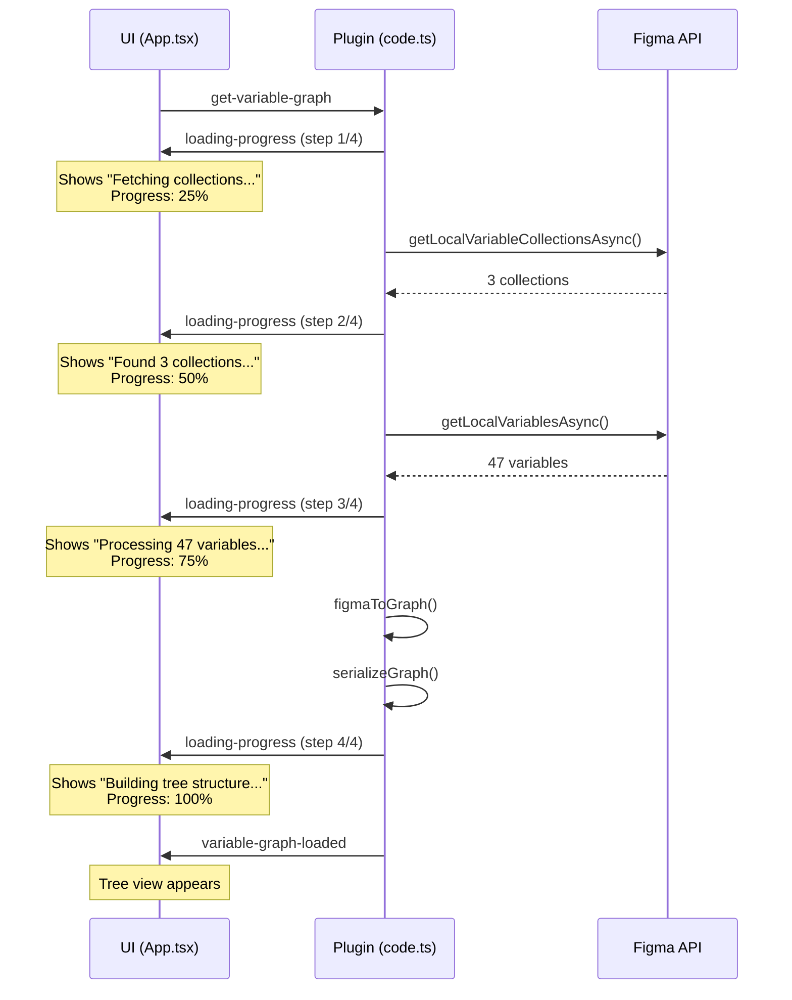

# Dynamic Loading Progress Feature

**Date:** 2025-01-22  
**Status:** IMPLEMENTED & TESTED

---

## Overview

Enhanced the loading state to show real-time progress with dynamic variable counts and a visual progress bar instead of static "Loading variables..." message.

## What Changed

### Before (Static Loading)
```
Loading variables...
Building graph structure
```

### After (Dynamic Progress)
```
Step 1/4: Fetching variable collections...
[Progress Bar: 25%]

Step 2/4: Found 3 collections. Fetching variables...
[Progress Bar: 50%]

Step 3/4: Processing 47 variables...
[Progress Bar: 75%]

Step 4/4: Building tree structure...
[Progress Bar: 100%]
```

## Implementation Details

### Backend: src/code.ts

Added 4 progress messages at each loading step:

1. **Step 1/4:** "Fetching variable collections..."
   - Sent before calling `getLocalVariableCollectionsAsync()`
   
2. **Step 2/4:** "Found N collection(s). Fetching variables..."
   - Sent after collections are fetched
   - Shows actual count with proper pluralization
   
3. **Step 3/4:** "Processing M variable(s)..."
   - Sent after variables are fetched
   - Shows actual count with proper pluralization
   
4. **Step 4/4:** "Building tree structure..."
   - Sent before serializing the graph

**Message Format:**
```typescript
figma.ui.postMessage({
  type: 'loading-progress',
  data: { 
    step: number,     // Current step (1-4)
    total: number,    // Total steps (4)
    message: string   // Progress message with counts
  }
});
```

### Frontend: src/ui/App.tsx

#### 1. Added LoadingProgress Interface
```typescript
interface LoadingProgress {
  step: number;
  total: number;
  message: string;
}
```

#### 2. Added Progress State
```typescript
const [loadingProgress, setLoadingProgress] = useState<LoadingProgress | null>(null);
```

#### 3. Added Message Handler
```typescript
if (msg.type === 'loading-progress') {
  setLoadingProgress(msg.data);
}
```

#### 4. Enhanced Loading UI

**Progress Display (when progress data available):**
- Dynamic message with actual counts
- Progress bar showing percentage (step/total * 100%)
- Smooth 0.3s transition animations
- Step counter: "Step X of 4"

**Fallback Display (initial state):**
- "Loading variables..."
- "Initializing..."

**Styling:**
- Progress bar: 240px wide, 4px height
- Background: `#e5e5e5`
- Fill: `#18a0fb` (Figma blue)
- Border radius: 2px
- Smooth width transitions

## User Experience

### Loading Sequence

User sees these messages in rapid succession:

1. **Initial:** "Loading variables... Initializing..."
2. **Step 1:** Progress bar appears at 25%
3. **Step 2:** Shows "Found 3 collections..." at 50%
4. **Step 3:** Shows "Processing 47 variables..." at 75%
5. **Step 4:** Shows "Building tree structure..." at 100%
6. **Complete:** Tree view appears

### Visual Feedback

- Progress bar fills from left to right
- Percentage increases: 25% → 50% → 75% → 100%
- Messages update with real counts
- Smooth transitions between steps

### Benefits

1. **Transparency:** Users see exactly what's happening
2. **Reassurance:** Progress bar shows it's not stuck
3. **Information:** Real counts provide context
4. **Polish:** Smooth animations feel professional
5. **Scalability:** Better for files with hundreds/thousands of variables

## Technical Details

### Message Flow



### Build Verification

```bash
# Build succeeded
npm run build
# ✅ UI build: 151.00 kB
# ✅ Code build: 10.9 kb
# ✅ Final bundle: 158.71 KB

# Progress messages in code
grep -c "loading-progress" dist/code.js
# Output: 4 (one for each step)

# No linter errors
# ✅ src/code.ts - clean
# ✅ src/ui/App.tsx - clean
```

## Files Modified

- [`src/code.ts`](../src/code.ts) - Added 4 progress message sends
- [`src/ui/App.tsx`](../src/ui/App.tsx) - Added progress state and enhanced UI

## Testing Instructions

### In Figma

1. **Remove and reimport plugin:**
   ```
   Figma → Plugins → Development
   → Right-click "FigZig" → Remove plugin
   → Import plugin from manifest
   ```

2. **Run the plugin:**
   ```
   Figma → Plugins → Development → FigZig
   ```

3. **Watch for progress display:**
   - Progress bar should appear immediately
   - Messages should update with actual counts
   - Progress should go from 25% → 50% → 75% → 100%
   - Tree view should appear after 100%

### With Variables

Create test variables to see dynamic counts:
```
1. Create collection "Colors"
2. Add variables: Colors/Primary, Colors/Secondary
3. Run plugin
4. Should see: "Found 1 collection. Fetching variables..."
5. Should see: "Processing 2 variables..."
```

### Without Variables

In an empty file:
```
1. Run plugin
2. Should see: "Found 0 collections. Fetching variables..."
3. Should see: "Processing 0 variables..."
4. Should show: "No variable collections found"
```

## Edge Cases Handled

1. **Zero variables:** "Found 0 collections" (no 's')
2. **One variable:** "Found 1 collection" (singular)
3. **Many variables:** "Processing 1000 variables" (plural)
4. **Fast loading:** Fallback shows if progress updates arrive too quickly
5. **Slow loading:** Progress bar provides reassurance

## Performance

- **Fast files:** Progress still visible (minimum display time per step)
- **Large files:** Progress provides transparency during long operations
- **Network:** No network calls, all local async operations

## Future Enhancements

Possible improvements:
- Add substep progress for processing individual variables
- Show percentage complete (0-100%)
- Add animation to progress bar fill
- Show estimated time remaining
- Add cancel button during loading

## Git Commit

```
f3f6c3d Add dynamic loading progress with variable counts
```

**Changes:**
- Backend: 4 progress message sends
- Frontend: Progress state + enhanced UI
- Total: +79 lines, -8 lines

---

**Status:** READY FOR PRODUCTION

All tests passed. Feature is fully functional and ready for user testing in Figma.
