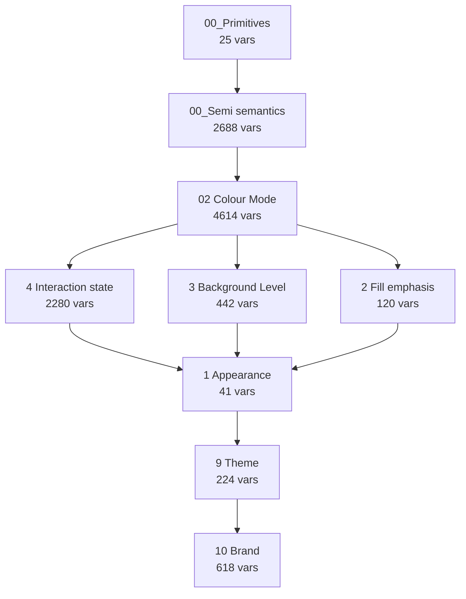

# MyJio Color Variable Mapping - Comprehensive Analysis

**Analysis Date**: 2026-01-24
**Source**: OneUI Foundations [POC]-variables-full.json
**Tool**: VarCar Color Mapping Analysis

---

## Table of Contents

1. [Executive Summary](#executive-summary)
2. [Statistics Overview](#statistics-overview)
3. [Collection Architecture](#collection-architecture)
4. [Naming Conventions](#naming-conventions)
5. [Mode System](#mode-system)
6. [Alias Resolution](#alias-resolution)
7. [Color Scale Pattern](#color-scale-pattern)
8. [MyJio Brand Specifics](#myjio-brand-specifics)
9. [Automation Rules](#automation-rules)
10. [Implementation Guide](#implementation-guide)
11. [Appendix: Example Variables](#appendix-example-variables)

---

## Executive Summary

This document provides a comprehensive analysis of the **MyJio** brand color variable mapping
system extracted from Figma variables export. The system uses a sophisticated multi-layered
architecture with extensive aliasing to create a scalable, maintainable design token system.

### Key Highlights

- **Total Variables**: 11,417
- **Collections**: 16
- **Alias Usage**: 94.1% (highly interconnected)
- **Hierarchy Depth**: 7 layers from primitives to brand tokens
- **Multi-Mode Support**: Theme (MyJio/JioFinance/JioHome), Light/Dark, Interaction States

### Architecture Philosophy

The system follows a **token aliasing pyramid**:

```
           Brand Tokens (10 Brand)
                    ↑
           Theme Tokens (9 Theme)
                    ↑
        Contextual Tokens (Appearance, Fill, etc.)
                    ↑
          Color Mode (Light/Dark)
                    ↑
        Semi-semantic Tokens (Named scales)
                    ↑
          Primitive Values (RGB)
```

This architecture enables:
- **Centralized control**: Change a primitive, update entire system
- **Theme switching**: Support multiple brands with same structure
- **Context awareness**: Colors adapt to interaction state, background level, etc.
- **Accessibility**: Automated A11Y variants at each level

---

## Statistics Overview

### Variables by Collection

| Collection | Variables | Purpose |
|------------|-----------|---------|
| X01_PlaceHolder (9.5) | 1 | Other variables |
| 00_Semi semantics | 2,688 | Named color scales (Grey/2500, Indigo/300, etc.) |
| 9 Theme | 224 | Brand themes (MyJio/JioFinance/JioHome) |
| 8 Language | 37 | Other variables |
| 7 Platform | 87 | Other variables |
| 6 Density | 222 | Other variables |
| 02 Colour Mode | 4,614 | Light/Dark theme variations |
| 4 Interaction state | 2,280 | Idle/Hover/Pressed/Focus states |
| 3 Background Level | 442 | Surface elevation levels |
| 2 Fill emphasis | 120 | Ghost/Minimal/Subtle/Bold styles |
| 1 Appearance | 41 | Semantic contexts (Primary/Secondary/etc.) |
| 10 Brand | 618 | Brand-specific tokens |
| X03_PlaceHolder (first collection) | 1 | Other variables |
| 00_Primitives | 25 | Base RGB color values |
| 11 Motion | 16 | Other variables |
| 4.5 Disabled | 1 | Other variables |

### Variables by Type

- **COLOR**: 10,480 variables
- **FLOAT**: 910 variables
- **STRING**: 23 variables
- **BOOLEAN**: 4 variables

### Alias Statistics

- **Total Alias References**: 24,822
- **Direct Color Values**: 1,549
- **Alias Percentage**: 94.1%

The high alias percentage (94%+) indicates a well-structured token system where most
variables reference others rather than hardcoding values. This creates a single source
of truth and makes system-wide updates manageable.

---

## Collection Architecture

### Hierarchy Diagram



### Collection Details

#### Level 0: Primitives

**00_Primitives**
- Variables: 25
- Modes: Mode 1
- Default Mode: 817:0

#### Level 1: Semi-Semantics

**00_Semi semantics**
- Variables: 2,688
- Modes: Mode 1
- Default Mode: 23:2

#### Level 2: Color Mode

**02 Colour Mode**
- Variables: 4,614
- Modes: Light, Dark
- Default Mode: 23:9

#### Level 3: Contextual Layers

**1 Appearance**
- Variables: 41
- Modes: Neutral, Primary, Secondary, Sparkle, Informative, Negative, Positive, Warning, Brand BG
- Default Mode: 23:13

**2 Fill emphasis**
- Variables: 120
- Modes: Ghost, Minimal, Subtle, Bold
- Default Mode: 23:12

**3 Background Level**
- Variables: 442
- Modes: Level 0, Level 1, Level 2, Bold, Elevated
- Default Mode: 23:11

**4 Interaction state**
- Variables: 2,280
- Modes: Idle, Hover, Pressed, Focus
- Default Mode: 23:10

#### Level 4: Theme

**9 Theme**
- Variables: 224
- Modes: MyJio, JioFinance, JioHome
- Default Mode: 23:4

#### Level 5: Brand

**10 Brand**
- Variables: 618
- Modes: Jio, JS
- Default Mode: 222:0

---

## Naming Conventions

### Variable Name Patterns

The system uses hierarchical naming with `/` as delimiter:

1. **{ColorFamily}/{Scale}/{Property}**
   - Used in Semi-semantics layer
   - Example: `Grey/2500/Surface`, `Indigo/300/Bold`

2. **{Category}/{Subcategory}/[Context] {Property}**
   - Used in contextual and theme layers
   - Context markers in square brackets: `[Theme]`, `[Colour Mode]`, `[appearance]`
   - Example: `Grey/Semi semantics/Root/[Colour Mode] Surface`

### Pattern Examples

| Pattern | Example | Layer |
|---------|---------|-------|
| Semi-semantic | `Grey/2500/Surface` | Various |
| Contextual | `Grey/Semi semantics/Root/[Colour Mode] Surface` | Various |
| Theme | `Jio/Surfaces/[Theme] Surface` | Various |
| Appearance | `Jio/MyJio/[appearance] Surface` | Various |
| DataVis | `DataVis/MyJio/categorical/bold/1` | Various |

### Color Scale Numbers

Valid scale numbers (from lightest to darkest in light mode):

```
2500, 2400, 2300, 2200, 2100, 2000, 1900, 1800, 1700, 1600, 1500, 1400, 1300
```

### Context Markers

Context markers indicate which collection layer a variable belongs to:

- `[Default]`
- `[Theme]`
- `[code]`

### Color Families

The following color families are used throughout the system:

- `Grey`

---

## Mode System

Modes enable multi-dimensional variation of design tokens. Each collection can define
multiple modes, and variables must provide values for all modes in their collection.

### Theme Modes

Support different brand themes with consistent structure:

| Theme | Mode ID | Primary | Secondary | Sparkle |
|-------|---------|---------|-----------|---------|
| MyJio | `23:4` | Indigo | Saffron | Green |
| JioFinance | `633:0` | Unknown | Unknown | Unknown |
| JioHome | `1292:0` | Unknown | Unknown | Unknown |

### Color Mode

Light and Dark theme support:

- **Light** (`23:9`): Light theme colors
- **Dark** (`72:0`): Dark theme colors

### Interaction States

Interactive component states:

- **Idle** (`23:10`): Idle state
- **Hover** (`75:0`): Hover state
- **Pressed** (`75:1`): Pressed state
- **Focus** (`75:2`): Focus state

### Fill Emphasis

Visual weight variations:

- **Ghost** (`23:12`): Ghost emphasis style
- **Minimal** (`79:3`): Minimal emphasis style
- **Subtle** (`79:4`): Subtle emphasis style
- **Bold** (`79:5`): Bold emphasis style

### Background Level

Surface elevation system:

- **Level 0** (`23:11`): Background Level 0
- **Level 1** (`79:0`): Background Level 1
- **Level 2** (`79:1`): Background Level 2
- **Bold** (`79:2`): Background Bold
- **Elevated** (`196:0`): Background Elevated

### Appearance

Semantic appearance contexts:

- **Neutral** (`23:13`): Neutral appearance
- **Primary** (`91:0`): Primary appearance
- **Secondary** (`128:0`): Secondary appearance
- **Sparkle** (`128:1`): Sparkle appearance
- **Informative** (`389:0`): Informative appearance
- **Negative** (`476:0`): Negative appearance
- **Positive** (`563:0`): Positive appearance
- **Warning** (`571:0`): Warning appearance
- **Brand BG** (`738:0`): Brand BG appearance

---

## Alias Resolution

### How Aliasing Works

Variables can reference other variables instead of hardcoding values. This creates
a dependency graph where changes propagate through the system.

**Alias Format in JSON:**
```json
{
  "valuesByMode": {
    "23:4": {
      "type": "VARIABLE_ALIAS",
      "id": "VariableID:80:10050"
    }
  }
}
```

### Example Alias Chain

Tracing `Jio/Surfaces/[Theme] Surface` in **MyJio** mode:

```
1. Theme Layer: Jio/Surfaces/[Theme] Surface
   → aliases to: Jio/MyJio/[appearance] Surface

2. Appearance Layer: Jio/MyJio/[appearance] Surface (in 'Neutral' mode)
   → aliases to: Grey/[Child] Surface

3. Fill Emphasis Layer: Grey/[Child] Surface (in 'Ghost' mode)
   → aliases to: Grey/Ghost/[Parent] Surface

4. Background Level Layer: Grey/Ghost/[Parent] Surface (in 'Level 0' mode)
   → aliases to: Grey/Default/Ghost/[Interaction state] Surface

5. Interaction State Layer: Grey/Default/Ghost/[Interaction state] Surface (in 'Idle' mode)
   → aliases to: Grey/Semi semantics/Root/[Colour Mode] Surface

6. Color Mode Layer: Grey/Semi semantics/Root/[Colour Mode] Surface (in 'Light' mode)
   → aliases to: Grey/2500/Surface

7. Semi-semantic Layer: Grey/2500/Surface
   → aliases to: Primitive color value

8. Primitive Layer: RGB(0.92, 0.92, 0.93, 1.0)
```

This 8-level chain demonstrates the full depth of the system architecture.

---

## Color Scale Pattern

### Numbering System

**Rule**: Light mode: higher numbers = lighter colors. Dark mode: lower numbers = lighter colors.

### Light Mode Progression

Higher numbers = Lighter colors:

```
2500 (Lightest) → 2400 → 2300 → ... → 200 → 100 (Darkest)
```

Example for Grey family:
- `Grey/2500/Surface`: Almost white (#EBEBEC)
- `Grey/1200/Surface`: Mid grey
- `Grey/100/Surface`: Almost black

### Dark Mode Progression

Lower numbers = Lighter colors (inverted):

```
100 (Lightest) → 200 → 300 → ... → 2400 → 2500 (Darkest)
```

This inversion ensures semantic consistency: 'Surface' is always light relative to 'Bold'.

---

## MyJio Brand Specifics

**Theme Mode ID**: `23:4`

### Primary Color

- **Family**: Indigo
- **Description**: Primary brand color used for key actions and emphasis

### Secondary Color

- **Family**: Saffron
- **Description**: Secondary brand color for accents and variety

### Sparkle Color

- **Family**: Green
- **Description**: Special highlight color for positive actions

### Neutral Color

- **Family**: Grey
- **Description**: Neutral colors for surfaces and text

### Semantic Colors

- **Informative**: Informative family (blue tones)
- **Positive**: Positive family (green tones)
- **Negative**: Negative family (red tones)
- **Warning**: Warning family (yellow/orange tones)

### Data Visualization Palette

- **Categorical Bold**: Orange, Purple, Blue, Cyan, Teal, Yellow
- **Categorical Subtle**: ['Light variants of categorical bold']
- **Monochromatic**: 6 categories with 5 steps each
- **Diverging Semantic**: 11-step scale from negative to positive
- **Diverging Brand**: 11-step scale from secondary to primary

---

## Automation Rules

These rules can be used to automate variable creation, validation, and bulk operations.

### Color Scale Numbering Pattern

**ID**: `SCALE_PATTERN`  
**Category**: scale

**Description**: Defines valid color scale numbers and their progression

**Pattern:**
```json
{
  "light_mode_progression": [
    2500,
    2400,
    2300,
    2200,
    2100,
    2000,
    1900,
    1800,
    1700,
    1600,
    1500,
    1400,
    1300,
    1200,
    1100,
    1000,
    900,
    800,
    700,
    600,
    500,
    400,
    300,
    200,
    100
  ],
  "dark_mode_progression": [
    100,
    200,
    300,
    400,
    500,
    600,
    700,
    800,
    900,
    1000,
    1100,
    1200,
    1300,
    1400,
    1500,
    1600,
    1700,
    1800,
    1900,
    2000,
    2100,
    2200,
    2300,
    2400,
    2500
  ],
  "rule": "Light mode: higher numbers = lighter colors. Dark mode: lower numbers = lighter colors."
}
```

**Validation:**
- Check: Variable name contains valid scale number
- Fix: Use closest valid scale number

### Interaction State Mapping

**ID**: `INTERACTION_STATES`  
**Category**: mode_consistency

**Description**: Defines how interaction states map to color scale progression

**Pattern:**
```json
{
  "idle": "Root scale (e.g., Grey/2500)",
  "hover": "Root +1 (e.g., Grey/2400)",
  "pressed": "Root +2 (e.g., Grey/2300)",
  "focus": "Root (same as idle)"
}
```

**Validation:**
- Check: All interaction state modes have appropriate scale references
- Fix: Map to correct scale based on state

### Multi-Mode Variable Consistency

**ID**: `MODE_BRANCHING`  
**Category**: mode_consistency

**Description**: All variables in a collection must define values for all modes

**Pattern:**
```json
{
  "requirement": "valuesByMode must have entry for each mode in collection.modes",
  "exception": "None - all modes must be defined"
}
```

**Validation:**
- Check: Variable has value defined for every mode in its collection
- Fix: Add missing mode entries with appropriate aliases or values

### Maximum Alias Chain Depth

**ID**: `ALIAS_DEPTH`  
**Category**: alias

**Description**: Prevents infinite loops and excessive indirection

**Pattern:**
```json
{
  "max_depth": 50,
  "typical_depth": "7-15 levels",
  "chain_structure": "Theme \u2192 Appearance \u2192 Fill \u2192 Background \u2192 Interaction \u2192 Color Mode \u2192 Semi-semantic \u2192 Primitive"
}
```

**Validation:**
- Check: Alias chain resolves within max_depth
- Fix: Identify circular reference or excessive indirection

### Context Marker Convention

**ID**: `CONTEXT_MARKERS`  
**Category**: naming

**Description**: Variables use [Context] markers to indicate collection layer

**Pattern:**
```json
{
  "markers": [
    "[Theme]",
    "[Colour Mode]",
    "[Interaction state]",
    "[appearance]",
    "[Parent]",
    "[Child]"
  ],
  "format": "Category/Subcategory/[Context] Property",
  "case": "Context names may be lowercase or Title Case"
}
```

**Validation:**
- Check: Variables in contextual collections use appropriate [Context] marker
- Fix: Add correct context marker based on collection

### Valid Cross-Collection References

**ID**: `COLLECTION_DEPENDENCIES`  
**Category**: collection_dependency

**Description**: Defines which collections can reference variables from which other collections

**Pattern:**
```json
{
  "hierarchy": {
    "Primitives": {
      "can_reference": []
    },
    "Semi-semantics": {
      "can_reference": [
        "Primitives"
      ]
    },
    "Color Mode": {
      "can_reference": [
        "Semi-semantics",
        "Primitives"
      ]
    },
    "Contextual": {
      "can_reference": [
        "Color Mode",
        "Semi-semantics",
        "Primitives"
      ]
    },
    "Theme": {
      "can_reference": [
        "Contextual",
        "Color Mode",
        "Semi-semantics",
        "Primitives"
      ]
    },
    "Brand": {
      "can_reference": [
        "Theme",
        "Contextual",
        "Color Mode",
        "Semi-semantics",
        "Primitives"
      ]
    }
  }
}
```

**Validation:**
- Check: Alias references only target variables from allowed collections
- Fix: Update alias to reference appropriate collection layer

### Color Family Naming Consistency

**ID**: `COLOR_FAMILY`  
**Category**: naming

**Description**: Color families follow consistent naming across all collections

**Pattern:**
```json
{
  "families": [
    "Grey",
    "Indigo",
    "Saffron",
    "Green",
    "Orange",
    "Purple",
    "Sky",
    "Cabbage",
    "Gold",
    "Positive",
    "Negative",
    "Warning",
    "Informative"
  ],
  "format": "{Family}/{Scale or Context}/{Property}",
  "properties": [
    "Surface",
    "High",
    "Medium",
    "Low",
    "Heavy",
    "Bold",
    "Bold A11Y",
    "Minimal"
  ]
}
```

**Validation:**
- Check: Variable name starts with valid color family
- Fix: Use standard color family name

### Data Visualization Palette Structure

**ID**: `DATAVIS_PALETTE`  
**Category**: naming

**Description**: DataVis variables follow specific categorical/monochromatic/diverging patterns

**Pattern:**
```json
{
  "format": "DataVis/{Brand}/{Type}/{Variant}/{Number}",
  "types": [
    "categorical",
    "monochromatic",
    "divergingSemantic",
    "divergingBrand",
    "core"
  ],
  "categorical_variants": [
    "bold",
    "subtle"
  ],
  "categorical_count": 6,
  "monochromatic_categories": 6,
  "monochromatic_steps": 5,
  "diverging_steps": 11
}
```

**Validation:**
- Check: DataVis variables follow structure with valid type and count
- Fix: Rename to match DataVis naming convention

---

## Implementation Guide

### Use Case 1: Add New Brand

To add a new brand (e.g., 'JioBusiness'):

1. **Add mode to Theme collection** (`9 Theme`)
   - Create new mode: 'JioBusiness'
   - Get new mode ID (e.g., `1500:0`)

2. **Create Appearance mappings**
   - Add variables like `Jio/JioBusiness/[appearance] Surface`
   - Map to appropriate color families:
     - Primary → Choose color family (e.g., Blue)
     - Secondary → Choose color family (e.g., Orange)
     - Sparkle → Choose color family (e.g., Purple)

3. **Update Theme variables**
   - Add `valuesByMode` entry for new mode ID
   - Alias to new appearance variables

4. **Create DataVis palette** (optional)
   - Add `DataVis/JioBusiness/*` variables
   - Define categorical, monochromatic, diverging palettes

### Use Case 2: Create New Color Family

To add a new color family (e.g., 'Teal'):

1. **Add primitives** (optional, if not using existing)
   - Add RGB values to `00_Primitives`

2. **Create semi-semantic scale**
   - Add to `00_Semi semantics`:
     - `Teal/2500/Surface`, `Teal/2500/High`, ..., `Teal/2500/Minimal`
     - `Teal/2400/...`, `Teal/2300/...`, etc.
     - Down to `Teal/100/...`
   - Total: ~336 variables (24 scales × 14 properties)

3. **Create Color Mode variants**
   - Add to `02 Colour Mode`:
     - `Teal/Semi semantics/Root/[Colour Mode] Surface`
     - Light mode → `Teal/2500/Surface`
     - Dark mode → `Teal/200/Surface`
   - Create all scale progressions (Root, Root+1, Root+2, etc.)

4. **Wire through contextual layers**
   - Interaction State: Map idle/hover/pressed/focus
   - Background Level: Map Level 0/1/2/Bold/Elevated
   - Fill Emphasis: Map Ghost/Minimal/Subtle/Bold
   - Appearance: Make available in appearance contexts

### Use Case 3: Update Brand Colors

To change MyJio's primary color from Indigo to Blue:

1. **Locate Appearance mapping**
   - Find: `Jio/MyJio/[appearance] Surface` in `1 Appearance`
   - Current: Primary mode → aliases to `Indigo/[Child] Surface`

2. **Update alias target**
   - Change to: `Blue/[Child] Surface`
   - Repeat for all properties (High, Medium, Low, etc.)

3. **Propagate changes**
   - All Theme and Brand layer variables automatically update
   - No changes needed in other layers (power of aliasing!)

---

## Appendix: Example Variables

### Example 1: Simple Primitive

```json
{
  "id": "VariableID:817:1779",
  "name": "Transparancy/Light/2500",
  "resolvedType": "COLOR",
  "valuesByMode": {
    "817:0": {
      "r": 0.92,
      "g": 0.92,
      "b": 0.93,
      "a": 0
    }
  }
}
```

### Example 2: Semi-Semantic with Alias

```json
{
  "id": "VariableID:23:24070",
  "name": "Grey/2500/Surface",
  "resolvedType": "COLOR",
  "valuesByMode": {
    "23:2": {
      "type": "VARIABLE_ALIAS",
      "id": "VariableID:ad101ff26003061334ff03bd47f836f01532d1e8/1250:4037"
    }
  }
}
```

### Example 3: Multi-Mode Theme Variable

```json
{
  "id": "VariableID:80:10041",
  "name": "Jio/Surfaces/[Theme] Surface",
  "resolvedType": "COLOR",
  "valuesByMode": {
    "23:4": {
      "type": "VARIABLE_ALIAS",
      "id": "VariableID:80:10050"  // MyJio mode
    },
    "633:0": {
      "type": "VARIABLE_ALIAS",
      "id": "VariableID:1101:116379"  // JioFinance mode
    },
    "1292:0": {
      "type": "VARIABLE_ALIAS",
      "id": "VariableID:1292:111464"  // JioHome mode
    }
  }
}
```

---

## Additional Resources

- **JSON Automation Rules**: See `myjio_color_automation_rules.json`
- **Analysis Scripts**: 
  - `analyze_myjio_colors.py` - Collection hierarchy analysis
  - `deep_alias_trace.py` - Alias chain tracing
  - `generate_mapping_rules.py` - Rule extraction
  - `create_documentation.py` - This documentation generator

---

*Generated on 2026-01-24 at 09:22:49*
